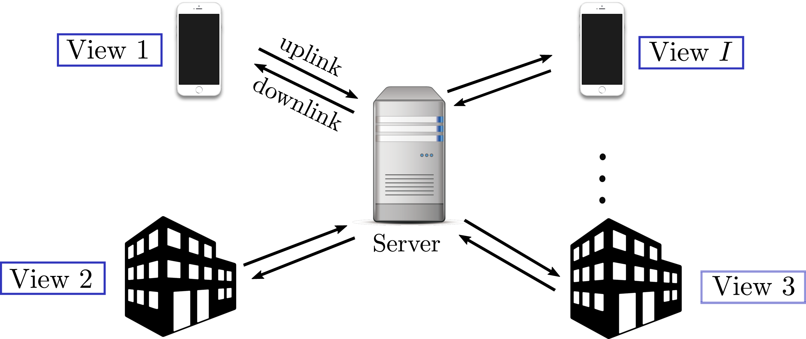
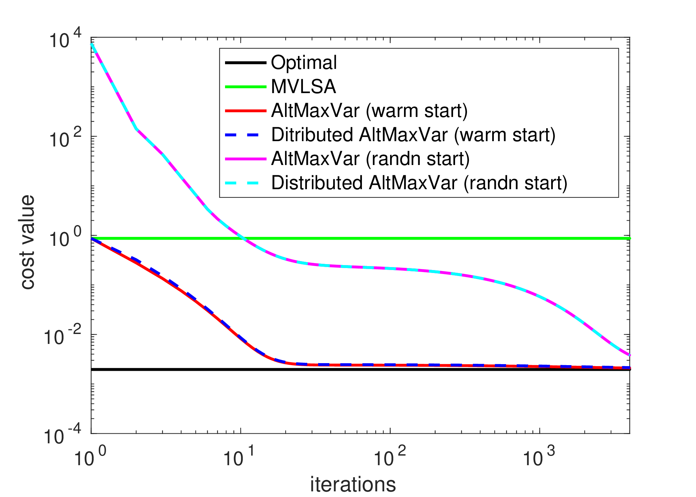
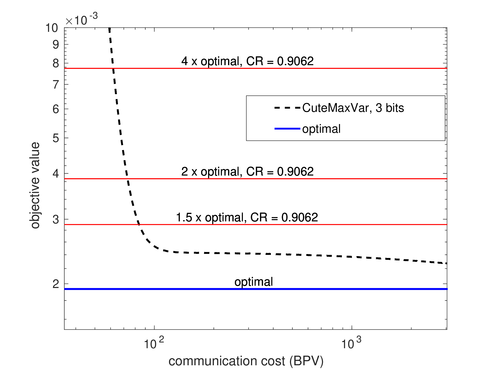
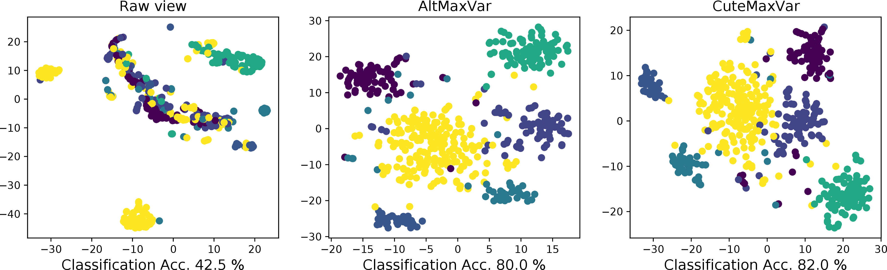
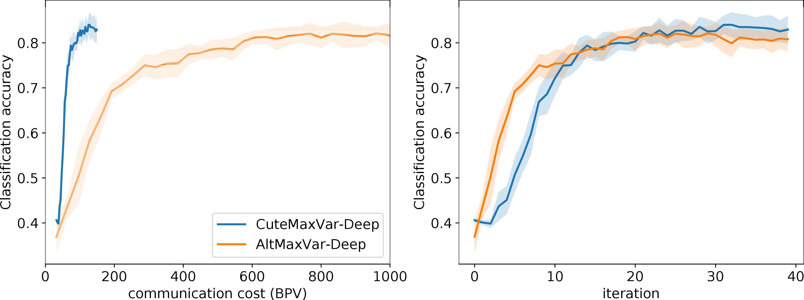

# Communication-Efficient Federated Linear and Deep Generalized Canonical Correlation Analysis (GCCA)

Implementation of the paper "[Communication-Efficient Federated Linear and Deep Generalized Canonical Correlation Analysis](https://ieeexplore.ieee.org/document/10099447)" published in IEEE Transactions on Signal Processing. A shorter conference version of the paper was published in ICASSP 2022, found [here](https://ieeexplore.ieee.org/document/9746607).

## Federated GCCA setting 

## Results

<figcaption>Synthetic data experiment</figcaption>

<!-- create a small vertical space -->

<!-- center align the subfigures -->

<!-- center align the figure caption -->
<figcaption>Real data experiment in EHR data</figcaption>

## Setup
Currently, Linear federated GCCA (CuteMaxVar) is implemented in MATLAB whereas Deep federated GCCA (Deep-CuteMaxVar) is implemented in python. The folder `gcca` contains the source code for CuteMaxVar, whereas `dgcca` contains the source code for Deep-CuteMaxVar.

For Linear GCCA
> Download tensor_toolbox and make sure it is in your matlab path.

For Deep GCCA, run the following command to install the required packages
> `conda install pytorch torchvision -c pytorch pandas scikit-learn scipy tqdm jupyter matplotlib`

## Executing the Code
For CuteMaxVar:
> `$ cd gcca`
> `$ matlab -nodisplay -nosplash -nodesktop -r "run('demo.m');exit;"`

For Deep-CuteMaxVar:
> `$ cd dgcca`

The folder `dgcca` contains two subfolders `toy_2d` and `ehr`. The former contains the code for the synthetic data experiment, whereas the latter contains the code for the EHR data experiment. Training and visualization for synthetic data experiment is in
> `dgcca/toy_2d/toy_dgcca.ipynb`

Whereas training and visualization for EHR data experiment is in
> `dgcca/ehr/ehr_dgcca.ipynb`

